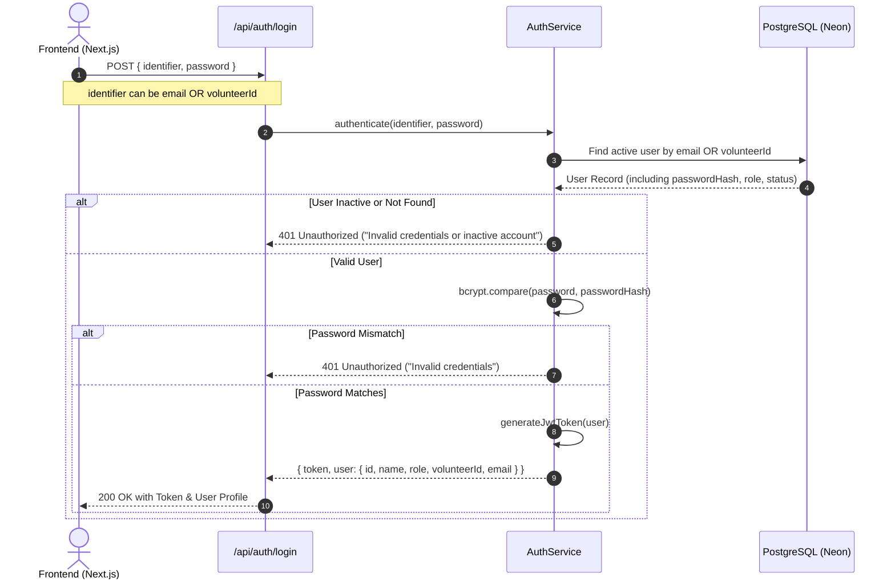

# Authentication & Role-Based Access Control (RBAC)

## 1. Authentication Strategy

The system utilizes **Stateless JWT (JSON Web Tokens)** for authentication and **`bcrypt`** (salt rounds = 10) for secure password hashing.

### Token Architecture
- **Bearer Token**: Transmitted in the `Authorization` header: `Authorization: Bearer <jwt_token>`.
- **JWT Payload**:
  ```json
  {
    "userId": "uuid-v4-string",
    "role": "ADMIN" | "VOLUNTEER",
    "volunteerId": "VOL-1001",
    "email": "user@example.com",
    "iat": 1726420000,
    "exp": 1727024800
  }
  ```

---

## 2. Login Flow by Role



### Identifier Flexibility
- **Admin Login**: Admin logs in using **Email** + **Password**.
- **Volunteer Login**: Volunteer can log in using either their assigned **Volunteer ID** (e.g. `VOL-1001`) or **Email** + **Password**.

---

## 3. Role-Based Access Control (RBAC) Matrix

| Endpoint Group | Admin Access | Volunteer Access | Unauthenticated |
|---|:---:|:---:|:---:|
| `POST /api/auth/login` | Allowed | Allowed | Allowed |
| `GET /api/auth/me` | Allowed | Allowed | Denied |
| `GET /api/admin/volunteers/*` | Full Access | Denied (403) | Denied (401) |
| `POST /api/admin/volunteers` | Full Access | Denied (403) | Denied (401) |
| `PATCH /api/admin/volunteers/:id/status` | Full Access | Denied (403) | Denied (401) |
| `POST /api/admin/tasks` | Full Access | Denied (403) | Denied (401) |
| `GET /api/admin/submissions/pending` | Full Access | Denied (403) | Denied (401) |
| `POST /api/admin/submissions/:id/review` | Full Access | Denied (403) | Denied (401) |
| `GET /api/volunteer/dashboard` | Denied (403) | Own Data Only | Denied (401) |
| `GET /api/volunteer/tasks` | Denied (403) | Own Data Only | Denied (401) |
| `POST /api/volunteer/tasks/:id/submit` | Denied (403) | Own Data Only | Denied (401) |

---

## 4. Middleware Pipeline

```typescript
// Authentication Middleware
authenticateJwt(req, res, next)

// Authorization Middleware
requireRole(['ADMIN'])
requireRole(['VOLUNTEER'])
```

1. `authenticateJwt`: Decodes token, verifies signature and expiration, retrieves user from database, checks if `status === 'ACTIVE'`, and attaches `req.user`.
2. `requireRole(allowedRoles)`: Checks if `req.user.role` is included in `allowedRoles`. Returns `403 Forbidden` if unauthorized.
