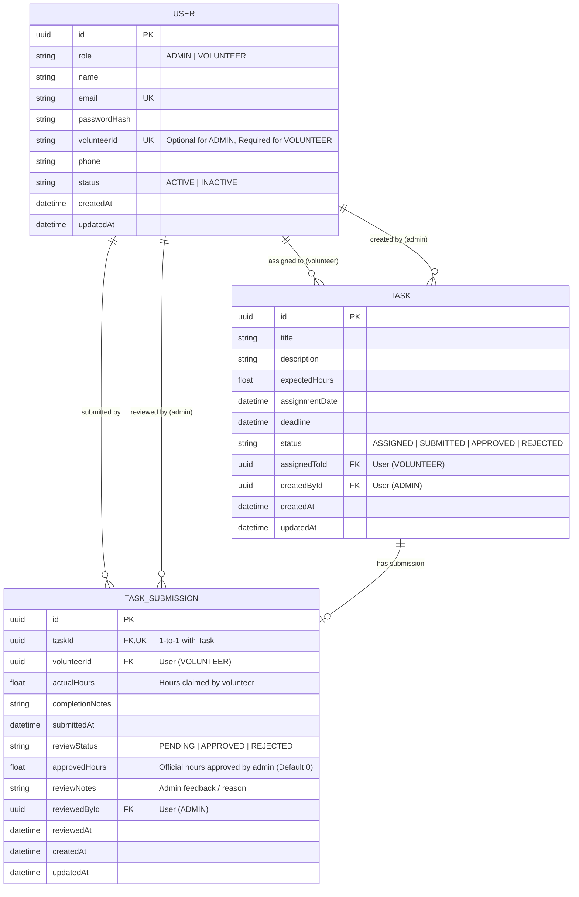

# Database Design & Relational Schema

## 1. Overview
The database uses **PostgreSQL** hosted on **Neon**, accessed exclusively through **Prisma ORM**.
The schema enforces single-source-of-truth integrity: official volunteer service hours are never duplicated as an aggregate field on the `User` record, but are dynamically computed via `SUM(approvedHours)` on approved `TaskSubmission` records.

---

## 2. Entity Relationship Diagram (ERD)



---

## 3. Recommended Entities Breakdown

### A. `User` Entity
Represents System Administrators and Registered Volunteers.

| Field | Type | Attributes | Description |
|---|---|---|---|
| `id` | `UUID` / `String` | Primary Key, Default UUID | Unique user identifier |
| `role` | `Role` (Enum) | `ADMIN`, `VOLUNTEER` | Access control tier |
| `name` | `String` | Not Null | Full name of the user |
| `email` | `String` | Unique, Not Null | Email address (used for Admin login) |
| `passwordHash` | `String` | Not Null | Bcrypt salted hash |
| `volunteerId` | `String` | Unique, Nullable | Identifier for volunteer login (e.g., `VOL-1001`) |
| `phone` | `String` | Nullable | Contact number |
| `status` | `UserStatus` (Enum) | `ACTIVE`, `INACTIVE` (Default: `ACTIVE`) | Account active/deactivated state |
| `createdAt` | `DateTime` | Default `now()` | Timestamp of creation |
| `updatedAt` | `DateTime` | `@updatedAt` | Timestamp of last modification |

> **Note**: Official hours are never stored on `User`. They are calculated dynamically as `SUM(TaskSubmission.approvedHours)` where `reviewStatus = APPROVED`.

### B. `Task` Entity
Represents an assignment created by an Admin and delegated to a Volunteer.

| Field | Type | Attributes | Description |
|---|---|---|---|
| `id` | `UUID` / `String` | Primary Key, Default UUID | Unique task identifier |
| `title` | `String` | Not Null | Short title of the task |
| `description` | `String` (Text) | Not Null | Full details and requirements |
| `expectedHours` | `Float` | Not Null | Estimated hours for task completion |
| `assignmentDate` | `DateTime` | Default `now()` | Date the task was assigned |
| `deadline` | `DateTime` | Not Null | Task due date and time |
| `status` | `TaskStatus` (Enum) | Default `ASSIGNED` | Current state of task (`ASSIGNED`, `SUBMITTED`, `APPROVED`, `REJECTED`) |
| `assignedToId` | `UUID` | Foreign Key -> `User.id` | Target volunteer |
| `createdById` | `UUID` | Foreign Key -> `User.id` | Admin who created the task |
| `createdAt` | `DateTime` | Default `now()` | Creation timestamp |
| `updatedAt` | `DateTime` | `@updatedAt` | Update timestamp |

### C. `TaskSubmission` Entity
Captures the submission details entered by the volunteer, as well as the administrative review and hours verification.

| Field | Type | Attributes | Description |
|---|---|---|---|
| `id` | `UUID` / `String` | Primary Key, Default UUID | Unique submission record |
| `taskId` | `UUID` | Foreign Key -> `Task.id`, Unique | 1:1 relation with Task |
| `volunteerId` | `UUID` | Foreign Key -> `User.id` | Volunteer who submitted |
| `actualHours` | `Float` | Not Null | Self-reported completion hours |
| `completionNotes` | `String` (Text) | Not Null | Work done, notes, or links |
| `submittedAt` | `DateTime` | Default `now()` | Time of submission |
| `reviewStatus` | `ReviewStatus` (Enum) | `PENDING`, `APPROVED`, `REJECTED` | Review state |
| `approvedHours` | `Float` | Default `0.0` | Verified hours granted by admin |
| `reviewNotes` | `String` (Text) | Nullable | Feedback/comments from admin |
| `reviewedById` | `UUID` | Foreign Key -> `User.id`, Nullable | Admin who approved/rejected |
| `reviewedAt` | `DateTime` | Nullable | Timestamp of review |

---

## 4. Enums Defined

```prisma
enum Role {
  ADMIN
  VOLUNTEER
}

enum UserStatus {
  ACTIVE
  INACTIVE
}

enum TaskStatus {
  ASSIGNED
  SUBMITTED
  APPROVED
  REJECTED
}

enum ReviewStatus {
  PENDING
  APPROVED
  REJECTED
}
```

---

## 5. Dynamic Hours Query

```sql
SELECT COALESCE(SUM(approved_hours), 0) AS total_approved_hours
FROM task_submissions
WHERE volunteer_id = :volunteerId AND review_status = 'APPROVED';
```
