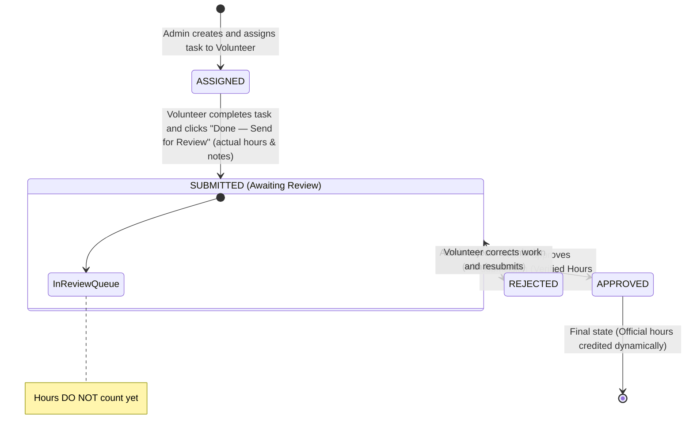

# Task Lifecycle & Service Hours Verification Workflow

## 1. Simplified Lifecycle State Diagram



---

## 2. Step-by-Step Task Workflow

### Step 1: Task Assignment (Admin)
- Admin creates task:
  - `title`: Short task name (e.g., "Food Distribution Drive")
  - `description`: Detailed instructions
  - `deadline`: Target completion date
  - `expectedHours`: Estimated effort (e.g., 4.0 hrs)
  - `assignedToId`: Selected volunteer
- Status is set to **`ASSIGNED`**.

### Step 2: Task Completion & Submission (Volunteer)
- Volunteer completes the required work.
- Volunteer clicks **"Done — Send for Review"**.
- Required Inputs:
  - `actualHours`: Total time spent (e.g., 3.5 hrs)
  - `completionNotes`: Description of work accomplished, outcomes, or notes.
- Status transitions directly to **`SUBMITTED`**.
- A `TaskSubmission` record is created/updated with `reviewStatus = PENDING`.
- ⚠️ **Critical Rule**: Zero hours are credited to the volunteer at this stage.

### Step 3: Administrative Review (Admin)
- Admin views all tasks with `status = SUBMITTED` in the "Submissions Awaiting Review" queue.
- Admin inspects the volunteer's completion notes and claimed `actualHours`.
- Admin chooses one of two outcomes:
  1. **APPROVE**:
     - Status updates to **`APPROVED`**.
     - Admin sets `approvedHours` (defaults to `actualHours`).
     - **Service Hours Crediting**: The `approvedHours` dynamically contribute to the volunteer's total verified service hours.
  2. **REJECT**:
     - Status updates to **`REJECTED`**.
     - Admin provides mandatory `reviewNotes` explaining what needs improvement.
     - **0 hours** are credited. The volunteer can view the feedback, make corrections, and click "Done — Send for Review" again.

---

## 3. Dynamic Calculation Specification

```
Total Official Volunteer Hours = SUM(TaskSubmission.approvedHours WHERE volunteerId = :volunteerId AND reviewStatus = 'APPROVED')
```
