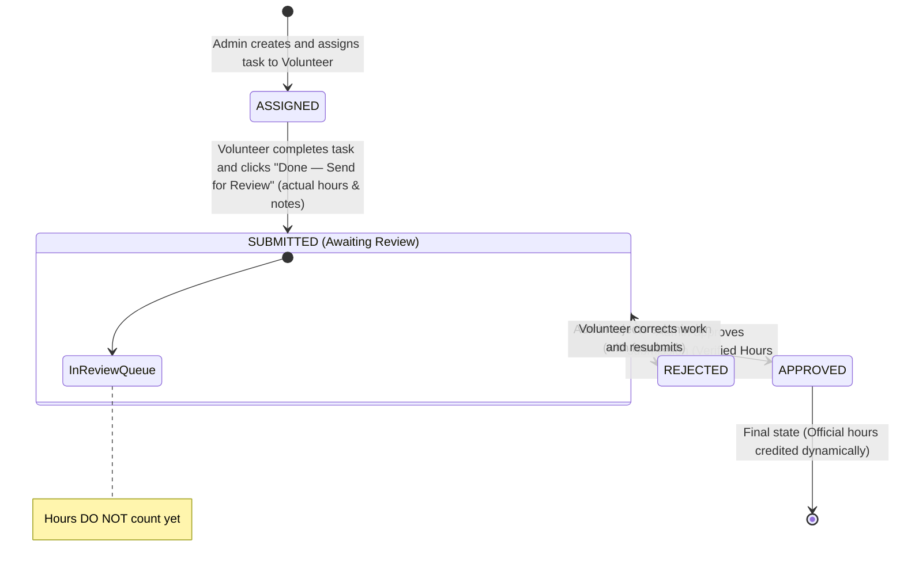

# Task Lifecycle & Service Hours Verification Workflow

## 1. Simplified Lifecycle State Diagram



---

## 2. Step-by-Step Task Workflow

### Step 1: Task Assignment (Admin)
- Admin creates task:
  - `title`: Short task name (e.g., "Food Distribution Drive")
  - `description`: Detailed instructions
  - `deadline`: Target completion date
  - `expectedHours`: Estimated effort (e.g., 4.0 hrs)
  - `assignedToId`: Selected volunteer
- Status is set to **`ASSIGNED`**.

### Step 2: Task Completion & Submission (Volunteer) — [IMPLEMENTED: Milestone 5]
- Volunteer completes the required work.
- Volunteer submits the task via `POST /api/volunteer/tasks/:id/submit`.
- Required Inputs:
  - `actualHours`: Total time spent (finite number > 0 and <= 24).
  - `completionNotes`: Description of work accomplished (non-empty trimmed string).
- Status transitions atomically from **`ASSIGNED`** to **`SUBMITTED`**.
- A `TaskSubmission` record is created atomically in a transaction:
  - `reviewStatus = PENDING` (server-enforced)
  - `approvedHours = 0` (server-enforced)
  - `submittedAt`: Server-generated timestamp
  - `reviewNotes = null`, `reviewedById = null`, `reviewedAt = null`
- ⚠️ **Critical Rules**:
  - Official volunteer service hours remain **0** at this stage. Submitted hours do NOT count until approved.
  - A volunteer cannot submit another volunteer's task (`403 Forbidden`).
  - A volunteer cannot submit a task twice (`409 Conflict`).
  - Volunteers can view their submission via `GET /api/volunteer/tasks/:id/submission`.

### Step 3: Administrative Review (Admin) — [PLANNED: Milestone 6]
- **Status**: Not implemented in Milestone 5. Scheduled for Milestone 6.
- Admin review workflow (future milestone):
  - Admin views all tasks with `status = SUBMITTED` in the submissions review queue.
  - Admin inspects the volunteer's completion notes and claimed `actualHours`.
  - Admin outcomes:
    1. **APPROVE**:
       - Status updates to **`APPROVED`**.
       - Admin sets `approvedHours` (defaults to `actualHours`).
       - Service Hours Crediting: The `approvedHours` dynamically contribute to the volunteer's total verified service hours.
    2. **REJECT**:
       - Status updates to **`REJECTED`**.
       - Admin provides mandatory `reviewNotes` explaining what needs improvement.
       - 0 hours are credited. The volunteer can view the feedback and resubmit.

---

## 3. Dynamic Calculation Specification

```
Total Official Volunteer Hours = SUM(TaskSubmission.approvedHours WHERE volunteerId = :volunteerId AND reviewStatus = 'APPROVED')
```
