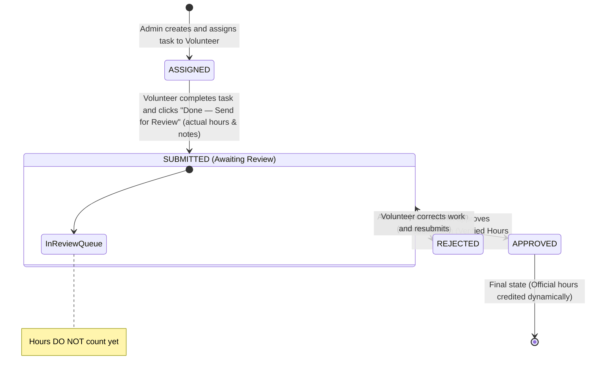

# Task Lifecycle & Service Hours Verification Workflow

## 1. Simplified Lifecycle State Diagram



---

## 2. Step-by-Step Task Workflow

### Step 1: Task Assignment (Admin)
- Admin creates task:
  - `title`: Short task name (e.g., "Food Distribution Drive")
  - `description`: Detailed instructions
  - `deadline`: Target completion date
  - `expectedHours`: Estimated effort (e.g., 4.0 hrs)
  - `assignedToId`: Selected volunteer
- Status is set to **`ASSIGNED`**.

### Step 2: Task Completion & Submission (Volunteer) — [IMPLEMENTED: Milestone 5]
- Volunteer completes the required work.
- Volunteer submits the task via `POST /api/volunteer/tasks/:id/submit`.
- Required Inputs:
  - `actualHours`: Total time spent (finite number > 0 and <= 24).
  - `completionNotes`: Description of work accomplished (non-empty trimmed string).
- Status transitions atomically from **`ASSIGNED`** to **`SUBMITTED`**.
- A `TaskSubmission` record is created atomically in a transaction:
  - `reviewStatus = PENDING` (server-enforced)
  - `approvedHours = 0` (server-enforced)
  - `submittedAt`: Server-generated timestamp
  - `reviewNotes = null`, `reviewedById = null`, `reviewedAt = null`
- ⚠️ **Critical Rules**:
  - Official volunteer service hours remain **0** at this stage. Submitted hours do NOT count until approved.
  - A volunteer cannot submit another volunteer's task (`403 Forbidden`).
  - A volunteer cannot submit a task twice (`409 Conflict`).
  - Volunteers can view their submission via `GET /api/volunteer/tasks/:id/submission`.

### Step 3: Administrative Review (Admin) — [IMPLEMENTED: Milestone 6]
- Admin views submissions queue via `GET /api/admin/submissions` (filterable by `reviewStatus` and `volunteerId`).
- Admin inspects complete submission details via `GET /api/admin/submissions/:id`.
- Review Outcomes (must operate strictly on `PENDING` submissions; double review returns `409 Conflict`):
  1. **APPROVE (`PATCH /api/admin/submissions/:id/approve`)**:
     - Requires positive finite `approvedHours` bounded by:
       `approvedHours <= actualHours` AND `approvedHours <= task.expectedHours`.
     - Optional trimmed `reviewNotes`.
     - Atomically updates:
       - `TaskSubmission.reviewStatus = APPROVED`
       - `TaskSubmission.approvedHours = requested approved hours`
       - `TaskSubmission.reviewedById = authenticated admin ID`
       - `TaskSubmission.reviewedAt = now()`
       - `Task.status = APPROVED`
     - **Service Hours Crediting**: The approved hours dynamically contribute to the volunteer's official service hours.
  2. **REJECT (`PATCH /api/admin/submissions/:id/reject`)**:
     - Requires non-empty trimmed `reviewNotes` explaining why work was rejected.
     - Atomically updates:
       - `TaskSubmission.reviewStatus = REJECTED`
       - `TaskSubmission.approvedHours = 0`
       - `TaskSubmission.reviewedById = authenticated admin ID`
       - `TaskSubmission.reviewedAt = now()`
       - `Task.status = REJECTED`
     - **0 hours credited**. Rejected submissions never contribute to verified hours.

---

## 3. Dynamic Calculation Specification

Official volunteer service hours are NEVER stored as aggregate fields on the `User` record. They are always computed dynamically from approved `TaskSubmission` records:

```sql
SELECT COALESCE(SUM(approved_hours), 0)
FROM task_submissions
WHERE volunteer_id = :volunteer_id
  AND review_status = 'APPROVED';
```

### Hours Query Endpoints
- **Admin**: `GET /api/admin/volunteers/:id/hours`
- **Volunteer**: `GET /api/volunteer/hours`
